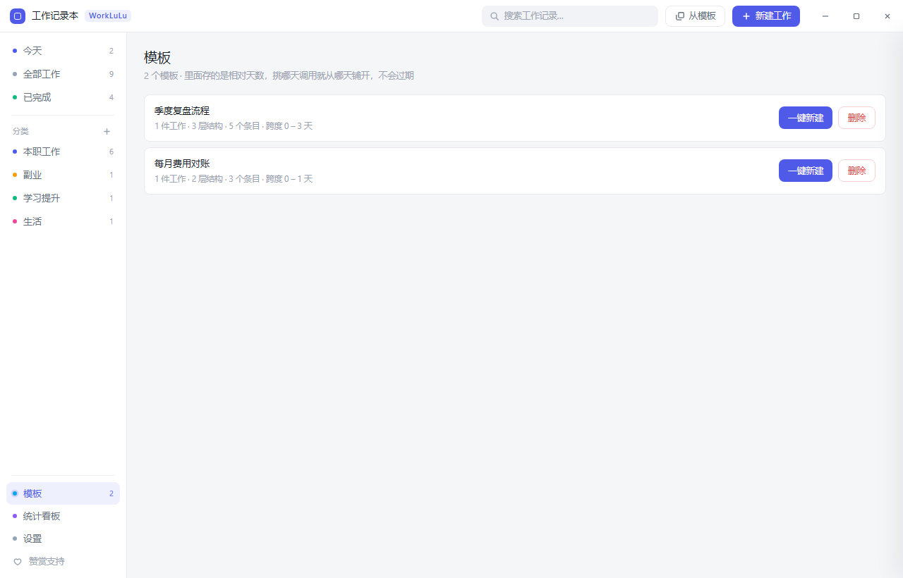

# 工作记录本

> 单文件、绿色免安装的 Windows 工作记录与周期排期工具。一个 exe，双击即用，数据全在本机。

<p>
  
  
  
  
</p>


---

## 这是什么

把日常要做的事分成三类，各自用合适的时间口径来管：

| 类型 | 时间怎么定 | 典型场景 |
| --- | --- | --- |
| **一次性** | 一个截止时间，到点提醒一次 | 临时任务、交差办事 |
| **周期性** | 设一条规则，之后自动排下一次 | 周报月报、例会、对账 |
| **阶段性** | 开始日 + 结束日，中间可拆子任务 | 项目、专项、学习计划 |

## 为什么要再造一个

市面上的待办工具不少，但这个工具在两个地方做了不同的取舍：

1. **周期性工作不需要"做完一次再手动建下一条"。** 排期引擎按规则直接算出下一次时间 —— 每周多选星期、每月指定日号（含月末语义）、每季度锚点月。做完一次，下次时间自动前移，历史留痕。
2. **阶段性工作看的是"结束日期"，不是"开始日期"。** 一个刚启动、还有两个月的项目，不该从第一天起就挂满红字。看板上按交期分列，阶段性任务只有真的过了结束日才进"已逾期"。

另外，所有数据都在本机 SQLite 里，程序不联网、不上传、不采集。

## 功能

### 周期规则

| 频率 | 说明 |
| --- | --- |
| 每天 | 到点提醒一次 |
| 每周 | 周一到周日任选，可多选（比如每周一、三、五） |
| 每月 | 自己挑 1~31 号。**选 31 号表示"月末"**，遇到 2 月这类小月会自动落到当月最后一天，不会整月跳过 |
| 每季度 | 先选从哪个月起算，再选几号。锚点 3 月 → 3/6/9/12 月；锚点 1 月 → 1/4/7/10 月 |

每种频率都可以单独设提醒时间。

### 提醒

- 到点弹 Windows 系统通知
- **点通知直接跳回那一条工作**，不是只把窗口叫起来
- 托盘右键可「暂停到期提醒 / 恢复到期提醒」，开会或休假时不用去改任务本身

### 托盘常驻

- 右键菜单：`打开主窗口 / 今天待办（N）/ 新建工作 / 暂停·恢复到期提醒 / 退出`
- 菜单项和悬停提示都直接显示今天有几件待办
- 左键点图标 = 打开窗口并切到「今天」
- 关窗口默认收进托盘继续后台跑，提醒不会因为关窗口而失效

### 贴边自动隐藏

想让它安静地待在屏幕边上、又不完全消失，就在设置里打开**贴边自动隐藏**（默认关）：

- 把窗口拖到屏幕**左边缘或右边缘**松手，它会滑到屏幕外，只留一条窄边；
- 鼠标碰到那条窄边就滑回来，鼠标移开一会儿再收回去；
- 从任务栏或 `Alt+Tab` 把窗口叫回来时，也会自动滑回来。

默认关是有意的：拖窗口贴边是很自然的动作，默认开的话，用户某天只会发现「窗口不见了」，还看不出是自己拖出去造成的。这个开关只改变窗口怎么摆，不写注册表、不动数据。

### 三种看的方式

三种视图共用同一套筛选条件，顶部搜索框在哪种视图下都生效。

**看板** —— 按「什么时候要」分列：已逾期 / 今天 / 接下来 7 天 / 更晚 / 没排期 / 已完成。卡片上直接带备注和子任务进度条。


**日历** —— 月历网格，工作按截止日落格。跨天的阶段性工作在整段跨度里淡着显示，不只标交期那一天——否则一个跨三周的大任务在日历上只出现一格，中间在忙什么看不出来。每格最多摆 3 条，多出来的显示「还有 N 项」，点开看全。点空白格直接在那天新建，滚轮翻月，右键有「顺延一天」这类快捷操作。


**统计看板** —— 完成趋势（近 30 天，区分周期性与一次性/阶段性）、活跃热力图（近半年），以及本周完成 / 本月完成 / 活跃天数 / 按时完成率四个指标。


### 其他

- **自定义分类**：新建、改名、改色、拖拽排序、删除。在某个分类里点新建时，分类已经替你带好了，不用再选一遍（要换点一下「更改」）；「今天」「全部」这类跨分类的视图照旧让你选
- **附件留痕**：详情里 `Ctrl+V` 直接粘聊天截图，也能拖文件进来。见下
- **备注**：列表里直接显示（最多两行），点开可编辑
- **子任务**：阶段性工作可拆成步骤逐条打勾，进度自动算进卡片；最多三层（工作 → 子任务 → 子子任务），到顶的那层界面直接不给「+」入口，不用点了才知道
- **模板**：把一整套（含各层步骤）存下来，下次选个基准日一键重建。顶栏「从模板」按钮就地就能用，不必先切到模板页。见下
- **复制一份**：连步骤带日期整体平移复制，适合「这件事下个月还要再做一遍」
- **搜索**：顶部输入即过滤，标题和备注一起搜
- **快捷键**：`Ctrl+N` 新建工作，`Ctrl+V` 粘贴截图或文件，`Esc` 关闭当前面板
- **开机自启**：可选，**默认关闭**；打开后登录即在托盘静默启动

### 模板：不重复手建同一套结构

一件事只要变成「每周/每月都要走一遍的流程」，手建就变成负担——先建父任务，再一条条加子任务，逐条排日期。

做法是：打开任意一条工作的详情 → 点「存为模板」→ 起个名字。它连同下面的各层步骤一起存进模板库（侧栏「模板」）。

下次用的时候，在顶栏点「从模板」（或到模板页点「一键新建」），选一个**基准日**，整批就按模板里的相对天数铺开。

顶栏那个入口是就地列模板、挑完直接接选日期这一步。对「这套流程今天就要走一遍」来说，先切到模板页再在卡片里找是多出来的一步。

关键在**模板里存的是相对天数，不是具体日期**：

| 模板项 | 相对基准日 |
| --- | --- |
| 整理材料 | 第 0 天开始，第 4 天交 |
| 对齐数据 | 第 0 天，第 1 天交 |
| 出结论页 | 第 3 天，第 4 天交 |

存「10 月 8 日截止」的话，下个月调用时就是一堆过期任务；存「第 4 天截止」，什么时候调用都成立。时分也一并留住，不会还原成默认时间。

模板删掉不影响已经建出来的工作；模板里的分类如果被删了，那一条会落到「未分类」，而不是拦下整批。

<p>
  
</p>

### 附件：把聊天截图直接粘进来

有些事得留个凭证 —— 跟对方确认的聊天记录、发来的报价单。这些东西留在聊天软件里，过两周就翻不到了。

做法是：打开任意一条工作的详情，在**附件**区直接 `Ctrl+V` 粘贴截图，或者把文件拖进去（也能点「选择文件」）。图片点开看大图，其它文件（PDF、Word 等）用系统默认程序打开。新建工作时也能直接粘贴，附件会先攒着，等工作保存成功再一起入库。

几个取舍：

- **图片存进数据库，不落成数据目录里的散文件。** 这样备份仍然是「一个 `.db` 拷到 U 盘就是全部数据」——换成散文件的话，用户换台机器恢复备份才发现图片全没了。
- **粘贴时先压一道。** 聊天截图动辄好几 MB，原样入库会让数据库和备份文件一起失控。截图优先用 PNG（里面全是字，JPEG 的块效应会把字糊掉），长截图或照片才退一步用 JPEG。
- **列表只加载缩略图**，原图等点开才取 —— 否则抽屉一打开就要搬几十 MB 过来。
- 单个附件上限 20 MB。删掉工作时，挂在它上面的附件跟着一起删。

### 备份、恢复与导出

设置页里有两个按钮管数据：

- **备份数据** —— 导出成一个独立的 `.db` 文件，拷到 U 盘或网盘都行。用的是 SQLite 的 `VACUUM INTO` 而不是复制文件：库跑在 WAL 模式下，直接复制可能漏掉还留在 `-wal` 里没并回主文件的改动，而且这种缺失是**静默**的（文件能打开、表也在，等真要用的时候才发现少了最近几天）。
- **从备份恢复** —— 选中备份文件后完全替换当前数据。这件事不可逆，所以恢复前会**自动把现在的数据另存一份**到 `backups` 文件夹，选错了还能切回来；恢复过程整体放在一个事务里，要么全成要么原样不动。备份文件会先校验（该有的表在不在、列数对不对得上），不是本程序导出的、或者版本对不上的，直接拒绝，不会恢复出一半。老版本建的备份里没有模板表，这种情况按「跳过模板」处理而不是拒收——用户可能只有那一份备份。

另外可以 **导出为 CSV**，Excel / WPS 直接打开（带 UTF-8 BOM，中文不乱码）。

<p>
  
</p>

这些都走系统原生文件对话框，用的是 Tauri 的 dialog 插件；本项目的 `withGlobalTauri` 开着，所以插件自带的 JS 包装直接就能用，不需要 npm 依赖。

<p>
  
  
</p>

## 下载

到 [Releases](../../releases) 页下载 `WorkLuLu-工作记录本-1.6.1.exe`，双击即可运行，不需要安装。

## 数据在哪

默认存在系统用户目录，**数据和程序是分开的**，所以 exe 可以随便挪位置、放 U 盘，数据不受影响。

| 位置 | 内容 | 能否删 |
| --- | --- | --- |
| `%APPDATA%\工作记录本\` | 数据库 `worklog.db`，你的全部记录 | 删掉即清空数据 |
| `%APPDATA%\工作记录本\backups\` | 恢复数据前自动留下的快照 | 可以随时删 |
| `HKCU\Software\Classes\AppUserModelId\com.local.worklog` | 一个通知标识，作用是让系统通知归属到「工作记录本 WorkLuLu」而不是 exe 文件名 | 可删，只是通知里会变回文件名 |

> 顺带一提：这个 AUMID 是用 Win32 注册表 API 写的，不是调 `reg.exe` —— 调外部进程既慢，又容易被安全软件记一笔。

### 便携模式：把数据放到程序旁边

想让整个文件夹拷到 U 盘就能带走，就打开**便携模式**。两种触发任选：

- 设置页 →「数据存放位置」→「切为便携模式」（会先问一次，然后把现有数据整体搬过去）；或者
- 在 exe 同级手动放一个空的 `portable.txt`，或建一个名为 `data` 的文件夹 —— 下次启动会把数据搬过去。

开了之后数据落在 `<exe目录>\data\`，`backups` 也跟着走。要换回来，用同一个按钮切回标准模式。

几点得先知道：

- **触发必须是显式的**，程序不会「检测到 exe 目录可写就自己便携」。真那样做的话，从别人手里拿到一个 exe、丢到 D 盘双击，就会打开一个空库 —— 看起来就像数据全丢了，而且完全看不出原因。
- exe 放在只读位置（`Program Files`、只读 U 盘、光驱）时**切不了**，设置页会把原因直接写在卡片上，不会静默退回用户目录（静默退回 = 你以为便携了，数据其实还在 C 盘）。
- 切换前会**自动留一份快照**，就放在 `backups` 里，跟着一起搬走。
- 两种触发都认，所以想手动关掉得把 `portable.txt` 和 `data` 目录一起去掉；用设置页的按钮最省事。
- 便携模式**只搬数据**。上面那个通知标识（AUMID）仍然写在注册表里 —— 不写的话系统通知会顶着 exe 文件名出来。要做到宿主机零痕迹就得牺牲这个，不划算。

## 自行构建

### 前置

- Rust **1.77+**
- MSVC 生成工具（VS 2022 Build Tools，勾选「使用 C++ 的桌面开发」+ Windows SDK）

**构建不需要 Node.js、不需要 npm**。前端是原生的 HTML/CSS/JS，没有构建步骤，Tauri 直接把 `app/ui` 当静态资源打包。（下面「自检」那一节的脚本要用 Node 跑，但那是开发期的事，跟出包无关。）

### 构建

```bash
git clone https://github.com/yijigu783/WorkLuLu.git
cd WorkLuLu/app/src-tauri
cargo build --release
```

产物在**仓库根**的 `target/release/worklog.exe`（这是 Cargo workspace，所有成员 crate 的产物统一落在根 target 下，不在 `app/src-tauri/target`），拷出来改成好认的名字就能用了。发布版命名为 `WorkLuLu-工作记录本-<版本号>.exe`，让人一眼看得出是哪一版。

改版本号要同步 **4 处**，漏一处 exe 属性里就对不上：

| 文件 | 位置 |
| --- | --- |
| `app/src-tauri/Cargo.toml` | `version` |
| `app/src-tauri/tauri.conf.json` | `version` |
| `app/ui/assets/app.js` | `APP_VERSION_FALLBACK`（关于页显示它） |
| `README.md` | 「下载」段里的文件名 |

（`Cargo.lock` 里 worklog 那条 cargo 会自己改，不用手动动。）

### 开发时看界面

改 UI 不用每次重新编译 Rust。`app/tools/make_preview.js` 会生成一份直接用 mock 数据渲染的静态副本，浏览器打开即所见：

```bash
cd app
node tools/make_preview.js today   out/         # 停在「今天」视图
node tools/make_preview.js today   out/ --mode=board
node tools/make_preview.js stats   out/ --drawer=2
node tools/make_preview.js today   out/ --modal=recurring.quarterly
```

## 项目结构

```
core/                     三端共享业务层：数据模型 + 周期排期引擎
                          纯计算，不碰数据库/文件/系统时钟，含单测
data/                     三端共享数据访问层：建表、增量迁移、增删改查
                          不依赖 tauri，库放哪儿由各端决定，含单测
app/
├── ui/                   桌面端前端（无框架、无打包器）
│   ├── index.html
│   └── assets/{app.js, style.css}
├── src-tauri/            桌面端 Rust 后端
│   ├── src/
│   │   ├── main.rs       托盘、窗口、30 秒巡检线程
│   │   ├── commands.rs   前端命令（薄包装：取锁 → 交给 data）
│   │   ├── db.rs         数据目录与便携模式（桌面独有）
│   │   ├── edge.rs       贴边自动隐藏
│   │   ├── snap.rs       窗口吸附与几何
│   │   ├── win32.rs      Win32 消息钩子
│   │   ├── notify.rs     Windows 通知与 AUMID 注册
│   │   └── single.rs     单实例
│   └── tauri.conf.json
└── tools/                自检与预览脚本（Node）
android/                  安卓端（骨架）
docs/                     截图与发布说明
```

排期算法和数据访问各自**只有一份实现**（`core/` 与 `data/`），桌面端和安卓端都依赖它们。
各端各写一遍的话，同一个周期任务会在两端滚出不同的日期，而用户不会想到是端的问题。

## 技术栈

- **Tauri 2** + **Rust**
- **rusqlite**（bundled SQLite，WAL 模式）
- **原生 HTML/CSS/JS**，无框架、无打包器
- 发布配置开了 `opt-level = "z"` + `lto` + `strip`，所以单文件只有 4 MB

## 自检

项目里带了一套防回归脚本，改完代码跑一遍：

```bash
cargo test                              # 130 个单测（桌面端 78 + 共享 data 29 + 共享 core 23），从仓库根跑
cd app && node tools/check_ui.js        # 177 项渲染自检
cd app && node tools/check_stats.js     # 8 项统计口径自检
cd app && node tools/check_contract.js  # 四类契约差集：命令 / data-act / 事件 / 托盘菜单
cd app && node tools/smoke.js           # 53 项浏览器冒烟（真 Edge/Chrome，不需要 npm 装包）
```

`check_ui.js` 在 Node 里用一个假 DOM 校验渲染函数吐出来的字符串，快、能覆盖边界，但证明不了
CSS 生效、事件真的接上了、控制台没报错。`smoke.js` 补的就是这一层：它调本机装好的
Edge / Chrome，开无头标签页真点、真粘、真按 Esc。两个都要跑，谁也替不了谁。

## 已知限制

这些都是有意留着的，不是没做完：

- **没有标签功能**，目前只有分类 + 搜索
- **只有浅色主题**，没做深色模式
- **附件存在数据库里，`.db` 会随截图变胖**。粘贴的图片已自动压过一道，但长期大量存截图还是会慢慢涨（设置页能看当前体积）。单个附件上限 20 MB
- **从模板建出来的工作不带附件** —— 模板存的是结构，不是某一次的证据
- **只支持 64 位 Windows 10 (1809+) / Windows 11**，不支持 Win7 —— 底层框架已停止支持 Win7，不是偷懒省事
- **依赖系统的 WebView2 运行时**。Win11 和打过较新补丁的 Win10 都自带；如果双击后没反应，装一次微软官方的 [WebView2 Evergreen Runtime](https://developer.microsoft.com/microsoft-edge/webview2/) 即可
- 如果通知不弹，先检查「设置 → 系统 → 通知」里是否放行了本程序，以及「专注助手（勿扰）」是否开着
- 备份要手动点，**没有自动定时备份**
- 恢复是整体替换，**不能合并两份数据**
- 便携模式只搬数据，不搬注册表里的通知标识（AUMID）和开机自启项（如果你开过）
- 贴边隐藏靠鼠标扫过露出的那条窄边唤醒；窄边被别的窗口压住时，从任务栏或 `Alt+Tab` 叫它回来也一样有效

## 关于名字

软件中文名 **工作记录本**，英文名 **WorkLuLu**，界面上两个名字并排显示；仓库名沿用英文名。

## 版权

© 2026 **JJAI** 制作，保留所有权利。

## License

代码以 [MIT](LICENSE) 许可开源。
